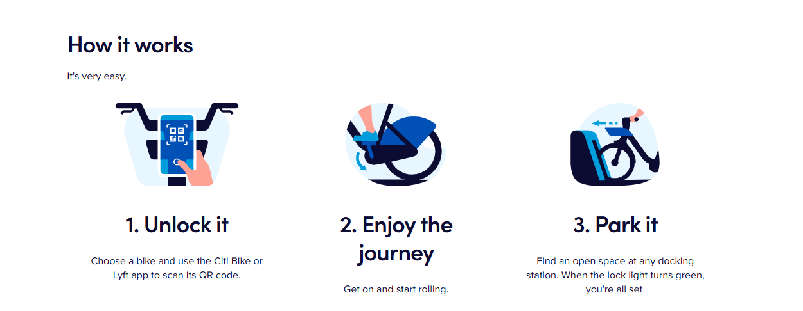
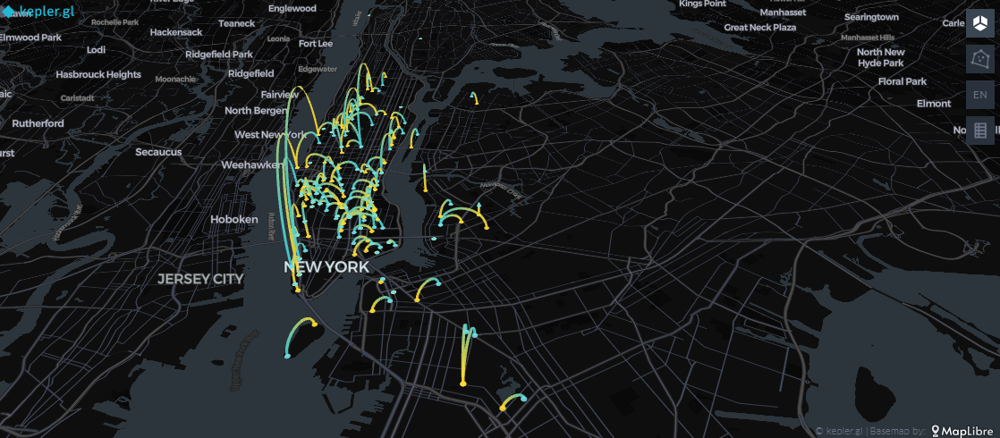
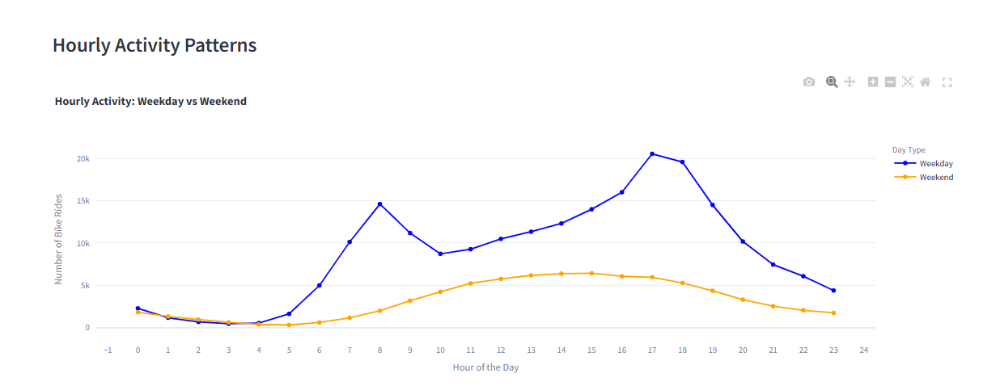

# Citi Bikes Strategy Dashboard

## Overview

Citi Bikes is the nation's largest bikeshare program, with **25,000 bikes** and over **1,500 stations** across Manhattan, Brooklyn, Queens, the Bronx, Jersey City, and Hoboken. This dashboard provides a comprehensive analysis of usage patterns, weather influences, station statistics, and strategic recommendations to enhance operations and user satisfaction.

The project uses **data-driven insights** and interactive visualizations to address challenges and optimize Citi Bike services.

---

## Features

### 1. Dashboard Overview
A high-level summary of Citi Bikes' usage trends and operational statistics, including:
- **Total Users:** 289,288
- **Average Trip Duration:** 10.15 minutes
- **Peak Usage Season:** Summer
- **Top Station:** W 21 St & 6 Ave

### 2. Interactive Trip Map
An interactive visualization of NYC Citi Bike trips using **Kepler.gl**:
- Displays the most popular routes and station connections.
- Highlights commuter and recreational traffic patterns.

#### Screenshot

### 3. Top Stations Analysis
In-depth analysis of the top 20 start and end stations:
- Segmented by **user type** (members vs casual users) and **seasonal trends**.
- Insights into peak usage periods and station-level demand.

### 4. Weather and Bike Usage
Explores the correlation between weather conditions and bike usage:
- Usage peaks in warmer months (May–October).
- Decline in activity below freezing temperatures.
- Seasonal recommendations for resource allocation.

### 5. User Analysis
Detailed breakdown of user behavior:
- **Casual Users:** Prefer weekends and recreational rides.
- **Members:** Use bikes consistently on weekdays for commuting.
- Highlights bike type preferences (electric vs classic).

#### Screenshot

### 6. Strategic Recommendations
Actionable insights to optimize Citi Bike services:
- Expand stations in high-demand areas (e.g., waterfronts).
- Scale down operations in winter while maintaining commuter access.
- Use predictive analytics to improve bike availability at key stations.

---

### Dataset

- **Source** : Citi Bike trip data (2022)
- The dataset has been processed and reduced to optimize performance on the platform.

### Technologies used: 
1. **Pandas & NumPy** : Data Processing and analysis
2. **Plotly & Matplotlib** : Graphical analysis
3. **Kepler.gl**: Interactive Map Visualization
4. **Streamlit** : Interactive web app framework
  
